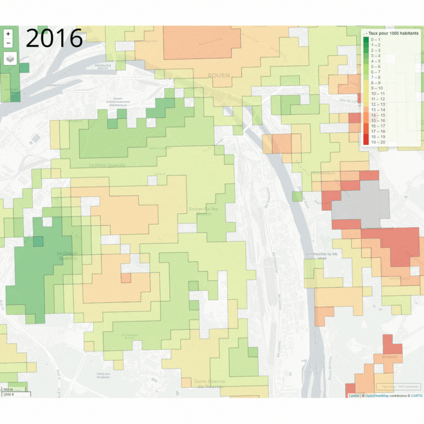

## Une commune particulièrement touchée par les cambriolages dans la Métropole

Où se situe Sotteville-lèes-Rouen dans les 71 communes de la Métropole Rouen Normandie ? Alors qu'elle était la 39ème commune subissant le plus de cambriolage, elle est passée 4ème en 2022 avant de refluer à la 11ème place en 2023. Sur la rive gauche, en 2023 seule Petit-Couronne était plus touchée.

## Une augmentation depuis le Covid visible sur les cartes

Le ministère de l'intérieur fournit des informations par quartier, ou plutôt par "carreau" de 200m. Le quartier de Sotteville-lès-Rouen le plus touché est à proximité du Jardin des Plantes. C'est là, comme on peut le voir sur cette animation, que se sont concentrées les cambriolages.

### Utilisation de Données Ouvertes

Pour objectiver cette information, nous avons utilisé les bases de données en open source fournies par le ministère de l’Intérieur. Cela nous a permis d'analyser les tendances sur une période plus étendue et d'apporter une perspective plus éclairée. Par souci de transparence, nous vous fournissons les liens qui ont été utilisés.

Toutes les données sont disponibles via ce lien : [Données publiques](lien_des_donnees.html). Le code source utilisé pour développer ce visualiseur est également accessible publiquement [ici](lien_code).

## Notre Réponse aux Problèmes de Tranquillité Publique

Les problèmes de tranquillité publique à Sotteville-lès-Rouen sont bien réels. En tant que groupe engagé, nous pensons que les solutions doivent être sociales et non uniquement sécuritaires. Voici nos propositions principales :

- **Amélioration du CLSPD** (Conseil Local de Sécurité et de Prévention de la Délinquance) : Nous proposons de renforcer ce dispositif en garantissant des réunions biannuelles et en accentuant le travail de terrain, pour répondre efficacement aux préoccupations des habitants.
  
- **Création d’un Observatoire de la Tranquillité** : Cet observatoire permettrait de mieux connaître les problèmes de tranquillité à Sotteville, tout en les objectivant et en les mettant en perspective. Cela offrirait une base solide pour une action publique plus cohérente.

- **Effectif de la Police Municipale** : L'effectif actuel nous semble adéquat, mais nous souhaitons engager la police municipale plus près des populations, dans un dialogue plus direct et constructif avec les citoyens.

- **Augmentation du Nombre d'Éducateurs de Rue** : Nous croyons fermement que le renforcement de l’encadrement social, notamment pour les jeunes, est essentiel. Cela passe par un plus grand nombre d’éducateurs de rue et un soutien aux actions sociales locales.

## Contactez-nous

N'hésitez pas à nous faire part de vos suggestions, de vos informations ou de toute demande, en vous rendant sur la rubrique [Contact](lien_contact).
